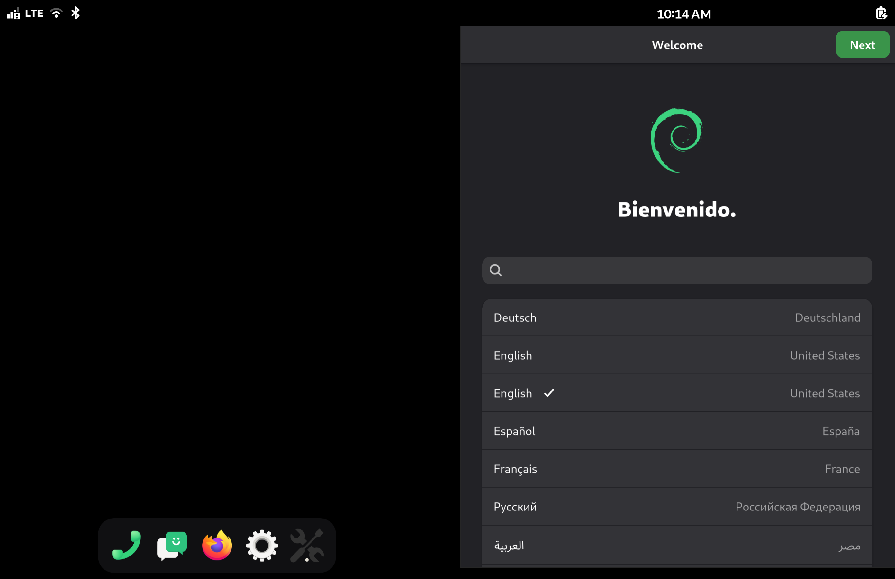
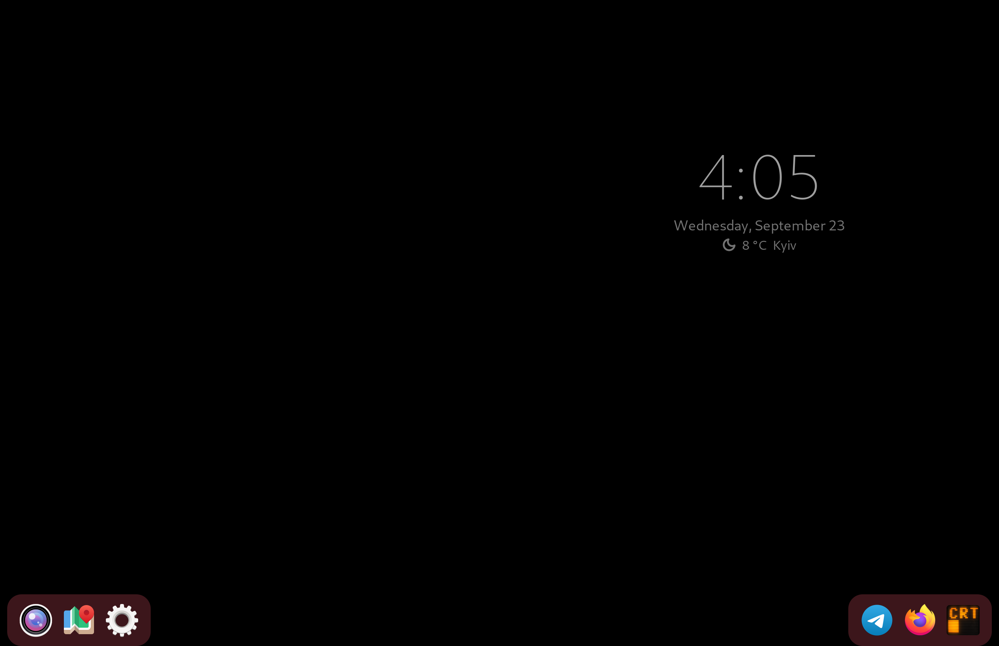
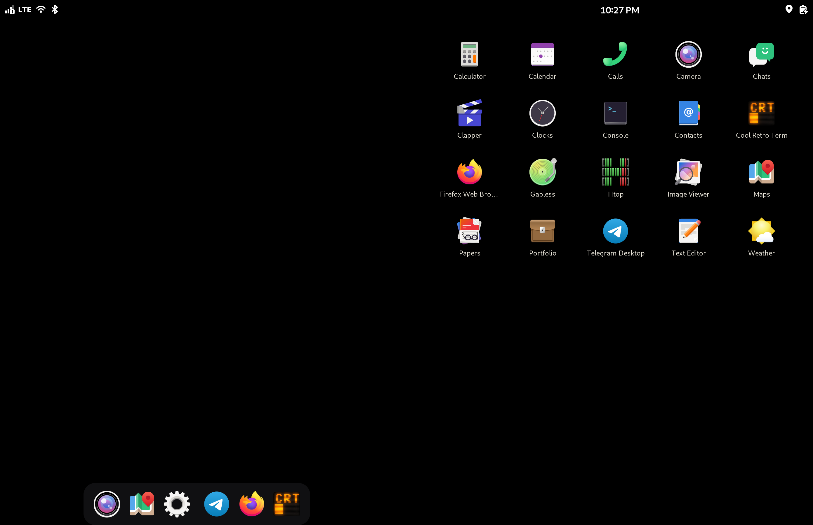
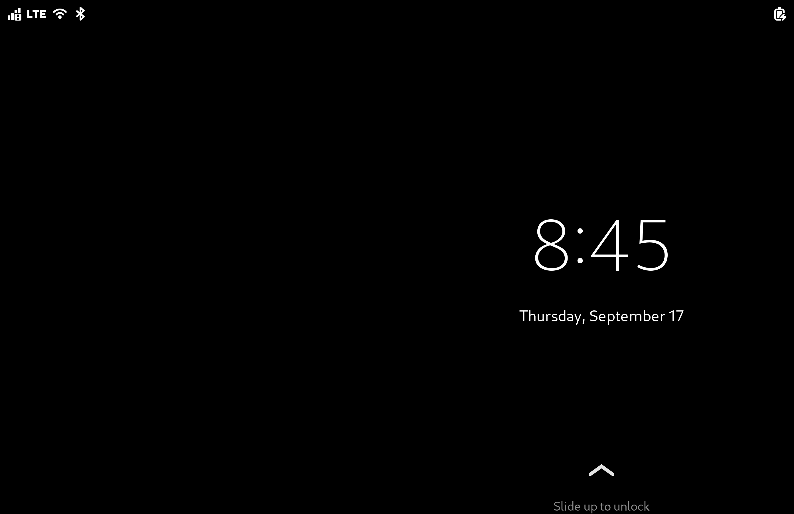

# Droidian on Microsoft Surface Duo 1

**An independent Linux port for the Microsoft Surface Duo 1** - Debian
arm64 (Droidian, Halium-based) running with both OLED panels and touch,
reusing the stock Android 11 vendor HALs via libhybris. Port bring-up
July 2026.

> **⚠️ READ THE SAFETY GUIDE FIRST.** The Surface Duo has **no public
> emergency-download (EDL) loader** - a bad flash can permanently brick
> it, with no software recovery path. This port is built around that
> constraint: everything goes through gated tooling
> (`tools/flash-safely.sh`), RAM-boot before any flash, one change per
> boot cycle. See [docs/SAFETY.md](docs/SAFETY.md). If you skip it, you
> accept the risk of a paperweight.

A boot to a fully working system (both panels, touch, WiFi auto-connect,
sshd over USB) takes about two minutes, hands-off - measured in September
2026 at 95-135 s from reboot to an ssh login. With the kernel built without
Microsoft's debugging (`kernel-packaging/droidian/surfaceduo-perf.config`,
2026-09-18) it is about half that, 40-50 s after `fastboot boot`.

## What it looks like

Screenshots of the one output both panels share (2784x1800; the 84 px column
the hinge hides is in the middle), taken on a from-scratch install of 0.14.2
at the port's output scale of 2.5. The two-panel shell is **experimental and
in development**.

| | |
|---|---|
|  |  |
| A window on the panel it opened on: the dock tiles it there, and the patched phoc stops it at the hinge rather than half way into it. | The dock, cut by the hinge rather than doubled. |
|  |  |
| Swipe up on a panel: every app, on that panel, and the dock crosses to the other. | The lock screen, kept off the hinge by CSS alone. |

## Status (2026-09-17)

| Subsystem | Status | Notes |
|---|---|---|
| Boot (RAM-boot) | ✅ | `fastboot boot`, no flashing required for testing |
| Both displays | ✅ | Phosh session, panel power management works; output scale 2.5 (1113x720 logical, Android's density) since 0.14.1 - Droidian's generic 3 gave a phone's worth of space |
| Touch | ✅ | MS D5 controller: kernel spi-hid → vendor HAL → uinput + udev rule |
| USB networking + ssh | ✅ | RNDIS gadget, 172.16.42.1 |
| System stability | ✅ | unlimited uptime once the ADSP is booted at start (adaptation handles it) |
| WiFi | ✅ | qcacld-3.0 built from Microsoft's OSS wlan repos against this kernel; autoloaded by the adaptation package; NetworkManager just works |
| Hinge angle (posture!) | ✅ | MS sns_fold on the SLPI via the sensorfw patch in this repo - live degrees over DBus |
| Audio | ✅ | 23 techpack modules from MS OSS + ADSP boot ordering; PulseAudio/droid picks the card up; TTS spoken through the speaker |
| Bluetooth | ✅ | bluebinder exonerated (the lockup was dead-ADSP collateral); needs the timeout drop-in + a provided board-address |
| Camera | ✅ | droidian-camera (QT_QPA_PLATFORM=wayland) - full 11MP stills |
| Fingerprint | ✅ | droidian-fpd + enroll; unlock-by-finger via fpd-unlockd |
| Suspend | ✅ | dwc3-msm kernel patch + sleep hook + AllowSuspend override; wake = long power press; RTC-through-sleep pending |
| Flashlight / vibration | ✅ | sysfs LEDs (video group via udev); da7280 (FF_CONSTANT only) |
| Pen (stylus) | 🟡 | it inks, but it is not a stylus to applications. The digitizer sends graded pressure, both buttons and a tool type; libinput discards all of it, because the node has to be classified as a touchscreen or touch dies. Measurements and the fix: [docs/PEN.md](docs/PEN.md) |
| Brightness | ✅ | the phosh slider drives both panels (udev change-event sync); auto-brightness pending (ALS already works) |
| Fold-to-sleep | ✅ | hall sensor (GPIO 121) → SW_LID bridge → logind suspends on fold; WoWLAN keeps WiFi associated through sleep |
| GPS | ✅ | vendor GNSS + geoclue hybris source, ~4 m fixes; needs the geoclue keepalive drop-in from the adaptation (see traps below) |
| Modem (calls/SMS/LTE) | 🟡 | LTE data works (70-90 ms pings) once the adaptation puts the modem online and on LTE at boot - it comes up offline and on 3G otherwise, see [adaptation/system](adaptation/system/README.md). Incoming SMS arrive; sending SMS and calls not tested yet |
| Video out (USB-C DP) | ❓ | the whole DisplayPort path sits in the stock device tree and probes cleanly; whether the lanes reach the connector has never been tested - see below |
| Dual-screen aware UI | 🧪 | experimental, in development: stock phosh spans both panels as one; the adaptation adds a dock across both that tiles each app onto the panel it was launched from, CSS that keeps the shell's own furniture off the hinge, and patched phosh and phoc binaries (focus after the app grid closes; tiled windows stop at the hinge) - see [adaptation/shell](adaptation/shell/README.md). Since 0.15 the on-screen keyboard takes one panel (a patched phosh-osk-stub); the notification shade still spans both |

## Repository layout

- `kernel-packaging/` - Droidian-style packaging for the
  [Microsoft OSS kernel](https://github.com/microsoft/surface-duo-oss-kernel.msm-4.14)
  (branch `surfaceduo/11/2022.902.48`): `debian/`, the device config
  fragment, kernel patches (`patches/` - suspend fix, log-noise fix,
  audio build fixups), build instructions (containerized, reproducible).
- `adaptation/` - the `adaptation-droidian-surfaceduo` package: USB
  access, offline sshd bundle, touch udev rule, wlan/audio module
  loading with ADSP boot ordering, hinge sensor config, suspend hooks,
  bluetooth bring-up (timeout + board-address), geoclue/GPS drop-in.
- `adaptation/system/` - the slot guard that keeps the bootloader on slot
  A, the lid policy (closing the device locks it), panel power without the
  compositor.
- `adaptation/shell/` - **experimental**: phosh across both panels. A dock
  that launches onto the panel you touch, the CSS that moves everything the
  shell centres off the seam, and patches for phosh itself (its own README
  covers the mechanisms and the traps).
- `sensorfw-hinge-patch/` - hinge-angle sensor support for sensorfw
  (its own README covers build + install).
- `docs/` - port guide + **the safety protocol** + `APPS.md`, what an
  application has to know about this screen (the seam, rotation, touch as
  WebKit delivers it, the cost of a frame, profiling with symbols).
- `tools/` - `flash-safely.sh` (gated flash pipeline: offline image
  validation, per-serial attempt limits, health baselines,
  brick-signature detection), vendored AOSP mkbootimg, stock-DTB
  extraction, parking-brake image maker.

## Quickstart (experienced porters)

1. Unlock the bootloader (Microsoft's official process).
2. Back up `boot_a`, `boot_b`, `misc` from a booted TWRP
   (RAM-boot only - never flash TWRP).
3. Extract the stock DTB from **your own** backup:
   `tools/extract-stock-dtb.sh boot_b.img` (device blobs are not
   redistributed here).
4. Build the kernel (`kernel-packaging/README.md`), pack the boot image
   with the stock DTB, `tools/flash-safely.sh validate` it.
5. Install the **Droidian 101 release** rootfs from TWRP, not the
   current nightly (a later nightly already broke this port once - the
   porting guide says how). Put the release's `.deb` in `out/` and its
   ssh bundle in `out/ssh-debs/`, and inject both with
   `adaptation/ssh/inject-ssh-twrp.sh` - the image ships no sshd.
6. `tools/flash-safely.sh ram-boot` - **RAM-boot only** until you have
   many boring-stable cycles behind you.

7. The first boot installs the package and **reboots itself once**; the
   second is the real one. When the device is online, `sudo
   sfduo-shell-setup` gives the experimental two-panel shell what a clean
   image lacks.

This path was run end to end on an untouched 101 image in September 2026;
what it found is in the 0.13.0 notes.

Full walkthrough: [docs/PORT-GUIDE.md](docs/PORT-GUIDE.md).

## Known kernel traps (the expensive lessons)

- **DTB scheme**: ship the GENERIC wildcard SoC DTB (as stock does) and
  let ABL merge the stock `dtbo` overlay. Shipping the per-board DTBs
  from `dts/surface/` silent-kills early boot (retail board-id is not
  among them).
- **BCB poison**: if stock Android ever normal-boots while a foreign
  rootfs sits on userdata, it writes `boot-recovery --prompt_and_wipe_data`
  into `misc`, after which ABL rejects *everything* per-slot. Cure:
  zero the first 2 KB of misc from TWRP. Prevention: a one-shot
  `bootonce-bootloader` BCB "parking brake" before every risky step.
- **Per-slot RAM-boot wedge**: after a crashed RAM-boot a slot may
  reject all further RAM-boots ("Device Error") while its getvars stay
  pristine. Switch slots; never retry a crashed kernel from your last
  good slot.
- **bluebinder false villain**: under a dead-ADSP/daemon-spin storm it
  soft-locks the kernel (`queued_write_lock_slowpath`) and takes all I/O
  down - but on a healthy system it is fine. The real fixes are a longer
  start timeout (chip re-init ≈65 s) and a pre-provided
  `/var/lib/bluetooth/board-address` (the Duo exposes no bdaddr
  property). Both ship in the adaptation package.
- **The Android ext4 `umount_end` hook** (patches/0004; likely affects
  every Halium port with a loop rootfs on an msm-4.14 kernel) - ONE
  downstream hook, TWO symptom classes. On every user umount(2) with
  the superblock still active in another namespace (i.e. on every
  systemd mount-namespace teardown of the root) it synchronously
  rewrote the live superblock and flipped the error policy to
  remount-ro. Symptom A: any unit with mount-namespace sandboxing
  (`ProtectSystem`, `PrivateTmp`, …) took ~40 s to spawn (geoclue was
  the visible victim - DBus activation times out at 25 s, so GPS looked
  dead while the GNSS stack was fine); with the hook removed the same
  unit spawns in 0.2 s. Symptom B: harmless journald write hiccups
  escalated into a read-only root - the phone "freezes" but still
  pings. Full evidence: `docs/FREEZE-FORENSICS.md`.
- **plymouth vs the vendor composer** (the classic first-boot failure:
  black screens right after the Debian logo): droidian ships plymouth.
  Depending on the install it may draw its splash or nothing at all,
  but either way it takes DRM master on /dev/dri/card0 at boot. When
  the boot is slow enough that the android container brings the
  composer up while plymouthd is still alive, the composer opens the
  device non-master and stays that way after plymouth quits: both
  panels black with the backlight on, phoc spams
  "validate failed for display 0: 2", logcat shows EACCES on
  drmModeAtomicCommit, the power key seems dead. The adaptation ships
  `sfduo-composer-watchdog` (detects the state and bounces the
  composer; note `setprop ctl.restart` does not restart it, only a
  kill does). On unencrypted installs `systemctl mask
  plymouth-start.service` removes the race entirely.
- **`data=journal` on userdata** (patches/0005): the halium initramfs
  mounts the ext4 userdata with `data=journal` (a 2014 UT workaround).
  With a loop rootfs on top, every root write double-writes through
  the outer journal; under bursts (`dpkg -i` is enough) jbd2 starves
  and the system stalls for minutes. `data=ordered` survives a 300 MB
  fsync burst with zero errors.
- **Page poisoning on by default**: Microsoft's defconfig ships
  `CONFIG_PAGE_POISONING` and `CONFIG_DEBUG_PAGEALLOC` with their
  `_ENABLE_DEFAULT` set, so every page freed is filled with a pattern,
  every page allocated is verified byte by byte, and the mapping is torn
  down and rebuilt each time (`memchr_inv`, `set_memory_valid`,
  `try_charge` in any perf profile). It taxes every allocation the
  device makes. `page_poison=off debug_pagealloc=off` on the cmdline
  (in `kernel-info.mk` since 2026-09) measured 15 points of CPU across a
  WebKit app's two processes; ABL appends its own arguments, so they
  arrive - check `/proc/cmdline`.
- **The defconfig is Microsoft's debug one**: page poisoning is one of 96
  options by which `vendor/surfaceduo_defconfig` - what this port builds -
  differs from `vendor/surfaceduo-perf_defconfig` in the same tree, and
  nearly all of them are debugging: `SLUB_DEBUG_ON` (on the device every
  slab cache reads `sanity_checks`, `red_zone`, `poison` and `store_user`
  = 1), `DEBUG_OBJECTS`, `DEBUG_KMEMLEAK`, `DEBUG_SPINLOCK`,
  `DEBUG_MUTEXES`, `DEBUG_LIST`, fault injection. What it seemed to cost:
  `systemctl daemon-reload` at 26-30 s every time, an ssh login that has to
  start a user manager at 27 s, a package
  postinst that enables a dozen units took nine minutes. **Most of that was
  not the kernel**: it was measured with the screen off, and Droidian's
  mobile-power-saver puts every core on the `powersave` governor while the
  screen is off - and, it turned out, from boot until the screen has been
  turned off and on once, and again for 300 s out of every 330 s after any
  `StopDozing` call, which headphone-manager makes on every USB-C plug (the
  package keeps the governor right while the screen is on since 0.15.1, see
  `adaptation/system/sfduo-cpufreq`). With the screen on and the governor where it
  belongs, the debug kernel does `daemon-reload` in 2.2 s. What the
  debugging really costs, measured the same way on both kernels
  (2026-09-18): 3000 `fork`+`exec` take 26 s against 11 s, a boot reaches
  ssh in about twice the time, and Slab holds 605 MB against 182 MB.
  Microsoft's perf defconfig is not the fix: it also drops what the port
  stands on (the backlight class, the GENI console, serdev). The fix is
  `kernel-packaging/droidian/surfaceduo-perf.config`, a fragment on top of
  the debug defconfig that turns off exactly the debugging - 92 config
  lines differ, all of them debug options. The release string is
  `4.14-190-perf-microsoft-surfaceduo`: the module ABI differs from the
  debug builds (`DEBUG_SPINLOCK` and friends change struct layouts), so the
  adaptation package carries wlan and audio modules per kernel release
  (`/usr/lib/sfduo/modules/<uname -r>/`) and the units pick the set for the
  running kernel.
- **GL for applications lands on llvmpipe**: `/usr/share/glvnd/egl_vendor.d/`
  registers only mesa, and mesa has no driver for this kernel, so any
  client that asks glvnd for EGL (WebKitGTK's WebGL, for one) gets the
  software rasteriser - eight `llvmpipe` threads - even though
  `libEGL_adreno.so` is already mapped into the process. A vendor JSON
  naming `libEGL_libhybris.so.0` and `__EGL_VENDOR_LIBRARY_FILENAMES`
  pointing at it puts the client on the GPU. Two things go with it: the
  app must inherit the session environment (`LD_PRELOAD=libtls-padding.so`
  above all - without it hybris cannot find Android's `libEGL.so` and
  the process falls to software and dies), and WebKit's dmabuf renderer
  stays disabled as the session has it: with mesa it measured 3x worse,
  with hybris it is indistinguishable from shared memory.

## Open question: video out over USB-C

No display has ever been plugged into this device under Linux, but the
whole DisplayPort path is present in Microsoft's own device tree and
comes up cleanly:

- `msm_drm` binds `qcom,dp_display@0`, and `mdss_pll_probe` reports
  "MDSS DP PLL"
- DRM exposes a connector, `card0-DP-1`, sitting at `disconnected`
- the DP AUX channel is registered as a real i2c adapter (`i2c-3:
  sde_dp_aux`)
- there is a DisplayPort audio DAI, `qcom,msm-dai-q6-dp`
- an FSA4480 SBU mux sits on i2c-0, which is the path AUX would take

What is unknown is whether the lanes physically reach the USB-C
connector. That part is a hardware question and can be answered on any
OS: if a passive DP alt mode adapter produces a picture under Android
or Windows, the lanes exist and the rest is a driver matter.

Under this port the check takes two minutes with a passive USB-C to
HDMI adapter:

```
cat /sys/class/drm/card0-DP-1/status      # "connected" = the lanes are there
dmesg -w | grep -iE 'dp_display|usbpd'
```

A report either way would settle it.

## Credits

- Microsoft for the OSS kernel drop.
- The Droidian project - rootfs, packaging tooling, porting guide.
- **Tygerpro**, whose independent Ubuntu Touch/Halium port of the Duo
  proved this device could run Linux.
- The WOA-on-Duo community for collective knowledge about this
  wonderful, weird device.

## License

Kernel packaging and kernel patches: GPL-2.0 (matching the kernel).
Scripts and adaptation: MIT. Documentation: CC-BY-SA 4.0.
`tools/mkbootimg/` is vendored from AOSP (Apache-2.0).
See `LICENSES/`.
